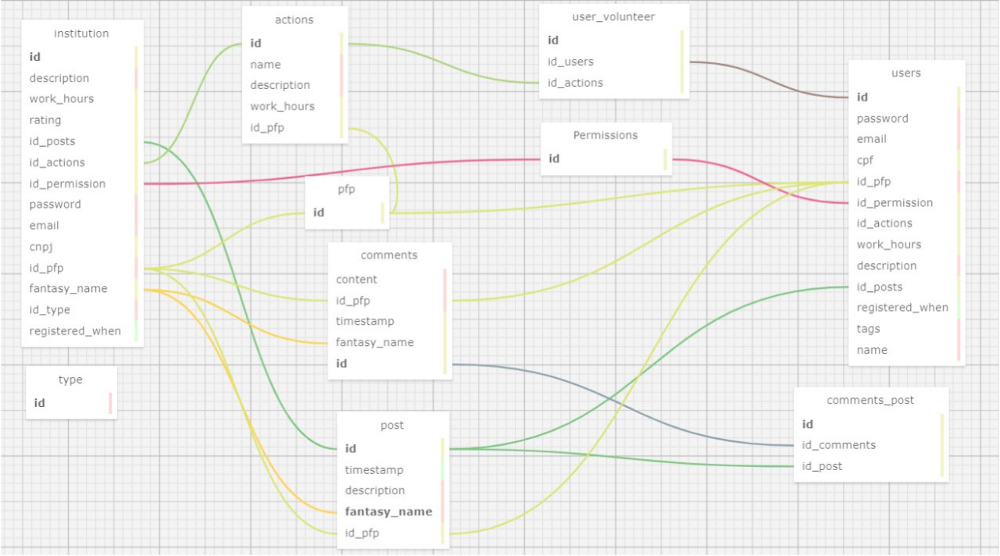

# Modelagem de banco de dados

### Modelo Relacional

O modelo relacional é uma das formas mais essenciais para organizar e manusear dados em bancos de dados, especialmente em aplicações web. Este modelo representa as informações em forma de tabelas para cada uma das entidades.

## Estrutura do Banco de Dados

A estrutura é desenvolvida em 5 tabelas principais e 5 auxiliares, que fazem com que a arquitetura  relacionado seja funcional tanto ao acesso direto quanto às futuras extensões para desenvolvedores.

Modelo Relacional do banco de dados 
 
 Fonte: Produzido no sqldesigner

 

### Tabelas Principais

1. **Institution**: Armazena propriedades específicas às instituições.
2. **Users**: Contém propriedades específicas aos usuários.
3. **Post**: Registra as postagens realizadas pelos usuários.
4. **Comments**: Armazena os comentários feitos nas postagens.
5. **Actions**: Denomina as ações voluntárias promovidas pelas instituições ou usuários em relações N para N.

### Tabelas Auxiliares

1. **PFP**: Armazena os links das fotos de perfil dos usuários e voluntários.
2. **Permissions**: Guarda as informações de permissões atribuídas aos usuários.
3. **Type**: Armazena os tipos de instituições possíveis, relacionada à tabela "Institution".
4. **User_Volunteer**: Relação N para N entre Usuários e Ações; várias Ações podem ser iniciadas por um Usuário, e vários Usuários podem estar envolvidos em uma Ação como participante.

#### Modelo Físico:

É vital que a estruturação cuidadosa e detalhada do banco de dados seja feita para o suporte e expansão das funcionalidades do projeto, de modo que o acesso e a gestão dos dados possam ser realizados de forma eficaz e sistemática. Finalmente, utilizando a estrutura de banco de dados feita através do sqldesigner, foi produzida uma query com todos os atributos necessários para a produção das respectivas tabelas. Abaixo está uma pequena parcela da query utilizada. Assim foi gerado um modelo físico estruturado que pode ser visualizado a partir do programa Dbeaver. A imagem do modelo pode, por sua vez, ser visualizada [Clique aqui para ver a Query completa](BancoDeDados.sql)